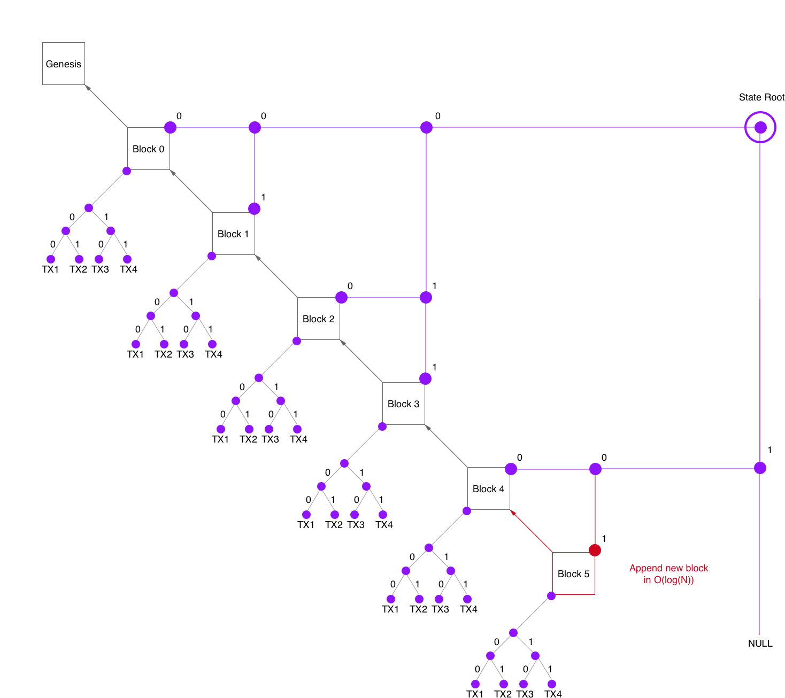
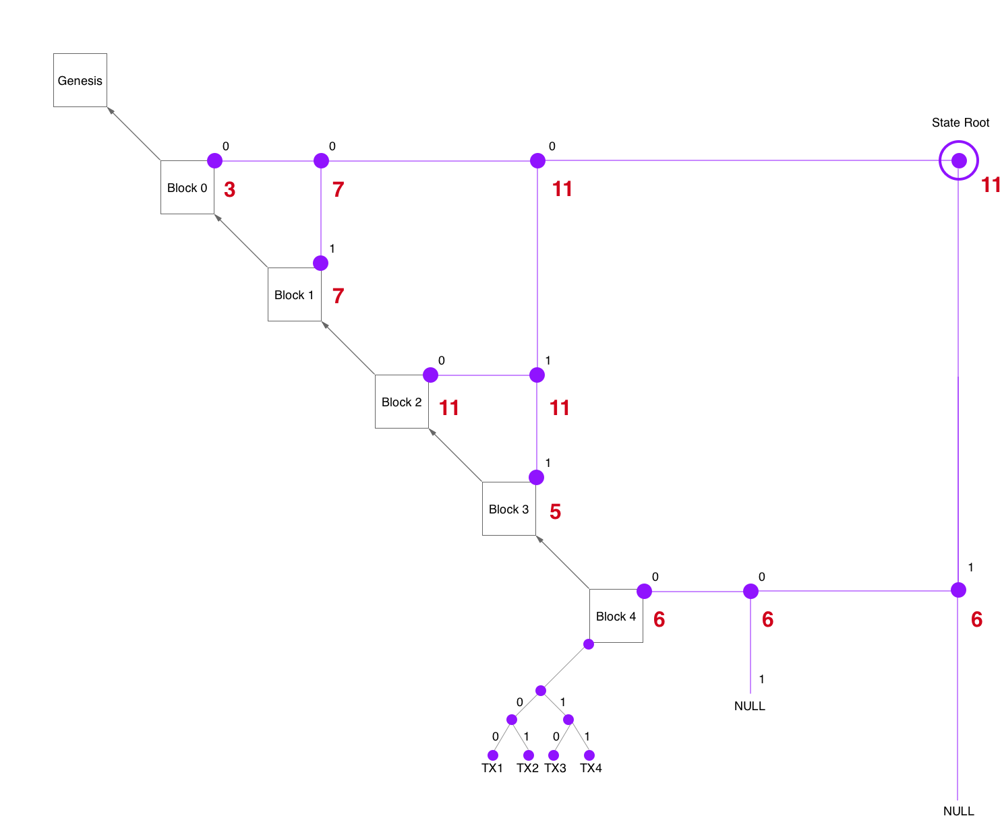

# State Tree

## Design Goals
- Fast, authenticated queries on the blockchain
- Fast insertion
- Prunable chain state
- Simple design

## Overview
The _State Tree_ is a modified blockchain: an authenticated, indexed, append-only _binary tree_.

-  _Headers tree_: an index for blocks in the chain.
  - _Proof of proofs of work_: compact proof of longest chain.
- TXO-IDs: an index for transaction outputs.
- UTXO bit vector: an index for _unspent_ outputs.
- Address index: an index for the unspent outputs of _addresses_.
- Transactions: compact inputs and signatures.

## Headers Tree

Classic blockcains organize a block's transactions in a Merkle tree. We apply this approch also to the blocks to build a Merkle tree on top of the whole blockchain.
This struture is similar to  a [Merkle Mountain Range](https://github.com/opentimestamps/opentimestamps-server/blob/master/doc/merkle-mountain-range.md) as [discussed in bitcoin](https://lists.linuxfoundation.org/pipermail/bitcoin-dev/2016-June/012758.html).

### Proofs of Proof of Work
Given another binary search tree on the most "heavy" blocks ( PoW >> difficulty target ), we can create the same effect as [Proofs of Proof of Work](https://eprint.iacr.org/2017/963.pdf) and therefore compress the headers chain proof logarithmically. This is very important to reduce the block time without increasing the sync load on nano clients.
This tree is simply represented and merkled within the nodes of the state tree. The additional overhead is about one byte per node.

Assuming Bitcoin's current state and a block height of 600000 the chain proof would be about
- `log2(600000)*80 + log2(600000)*log2(600000)*32 ~ 14Kb`
- or `log2(6000000)*80 + log2(6000000)*log2(6000000)*32 ~ 18Kb` assuming a 10x faster block time of 1 minute.

#### Probabilistic Proof of Proofs of Work
To further increase confidence in the chain's consistency nano nodes can also query for _random_ headers by header id. This exponentially increases the probabilistically proved work (as long as _every_ random query is answered).

## Indexes

### Block Index
A block's id is simply its block height. This fits well with the headers tree because the binary representation of the blockId corresponds to its path in the headers tree.
This way it is simple to answer a query for a block inclusion proof.

### Transaction Index
Since transactions are merkled within a block, we can address them canonically by their path in the transactions tree.

### Transaction Output Index
The id of an output of an transaction consists of:
- block index
- transaction index
- output index

### Properties
- Data identifiers are 64 bit numbers:
  - block index: 39 bit ( enough for 12 billion blocks )
  - tx index: 17 bit ( enough for 100 000 tx / block )
  - output index: 8 bit ( enough for 256 outputs / tx )
- not random! blocks, transactions and outputs are indexed incrementally. Index == precise point in time

## UTXO Bit Vector
For any given output index we want to know if the output is spent or unspent. Since TXO Id's are almost perfectly incremental, we simply represent the state of every output in a bit vector.

This approach scales well: even a naive 1 GB bit vector could store the state of 8 Billion outputs.

We can improve the naive space complexity drastically because the bit vector is very sparse.
Assuming the current state of bitcoin we'd have about 1 Billion transaction outputs containing only 50 Million _unspent_ outputs. Represented in our bit vector this results in a density of 1/20.

We can further reduce the amount of UTXOs by accumulating the total balance of an address in its latest output. Bitcoin currently has about 1 Million addresses owning unspent outputs. That reduces the UTXO set to about 1 Million entries ( assuming no script outputs for now ) which results in a density of 1/1000.

There are many simple algorithms to compress sparse bit vectors. Assuming a vector density of 1/1000 we can probably compress 1 GB to about 10 MB. Updating the bit vector is simple because there are only two cases:
- append new block ( append "1" for every output in block )
- spend output ( set v[i]="0" )

We can scale even better by chunking the bit vector:
  - Fixed chunk lengths ( i.e. 50 000 blocks, to limit chunk size to about 250 KB. )
  - Sorted by TXO Id ( which is equal to "sorted by age" )
    - to exploit the fact that _old_ UTXOs occur way less frequently than recent UTXOs. Therefore most updates aren't random, but tend to occur mostly in the most recent chunks.
  - Introduce a _Chunks tree_: simple Merkle tree for logarithmic chunk inclusion proofs.
  - Fixed chunks, this order and a Merkle tree implies another simple index and therefore it allows to answer queries without knowing the full vector but only the relevant chunks.

## Address Index
The UTXO bit vector can only prove that a certain TXO is unspent, though it can not answer which output belongs to a certain _address_.
Therefore we introduce the _Address Index_ which is basically the UTXO set ordered lexicographically by address.

A compact representation:
- Let N = "number of UTXOs".
- Let S = "range of integers from 1 to N"
- Every integer `i` in S corresponds to "the i-th UTXO" ( the actual i-th UTXO Id results from the bit vector )
- Sort S in lexicographic order of the address of the corresponding UTXO.

Assuming again Bitcoin's current state with 1 Million addresses, this would lead to an address index of about 2.5 MB. ( To scale beyond these numbers we can chunk the address index and combine it with the chunks of the UTXO bit vector. )

This design allows Nano nodes to perform a binary search to look up an address.
  - The overhead is about `O( log(N) * log(M) )` whereas `N` is the UTXO count and `M` is the TXO count. In Bitcoin's current state that's about 20 KB per address balance proof.

This is neither the most optimal representation nor query. Though this inefficiency is practical and it even has some advantages:
- Enhanced privacy
  - Queries can be split among different peers such that it becomes harder for an attacker to unveil a nano node's addresses.
- Enhanced load balancing
  - The Nano network inherently needs nano nodes to download more than what's relevant only to themselves. Therefore _not_ optimizing the state perfectly enforces nano clients to help scale the redundancy of state storage.

Possible Optimizations
- Addresses are uniformly distributed and therefore it is easy to calculate an educated guess for the range in which an address lies most likely. That reduces the query's overhead to `O( log(K) * log(M) )` whereas `K` is the length of the range and `K = O(log(N))`.
- The dominant factor is `M`. By not merkling every UTXO, but only transactions, we reduce the query overhead to `M=3*10^8` which is a gain of about 30%.

## Delayed Commitments
We do not want to introduce new consensus critical computation into the design of bitcoin. Therefore all indices are committed delayed: A block does not contain a commitment to the most recent state, but to the state of a predetermined predecessor such that all heavy computation can be precomputed before a new block is mined. This way we do not increase the other miners' time to verify a new block.
