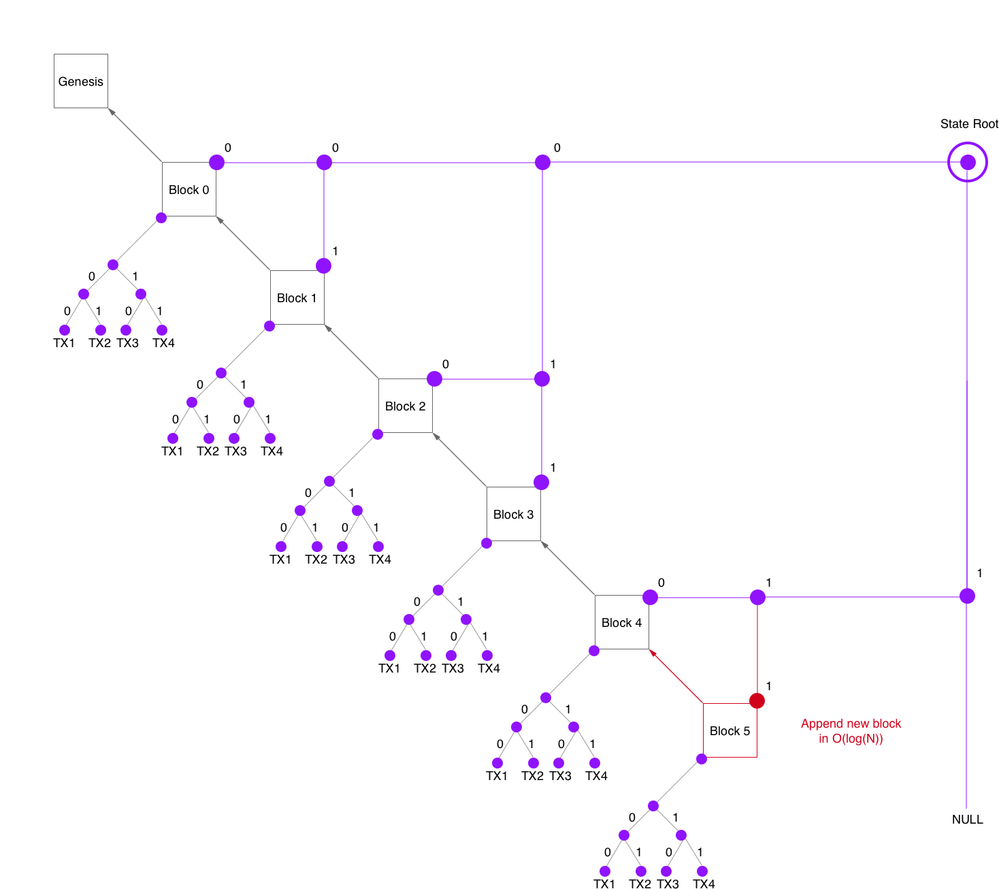

# State Tree

## Design Goals
- fast, authenticated queries on the blockchain 
- prunable blockchain data
- fast append
- Simple

## Overview
The State Tree is a modified blockchain: an authenticated, indexed, append-only _binary tree_. This struture is similar to  a [Merkle Mountain Range](https://github.com/opentimestamps/opentimestamps-server/blob/master/doc/merkle-mountain-range.md) as [discussed in bitcoin](https://lists.linuxfoundation.org/pipermail/bitcoin-dev/2016-June/012758.html).
Classic blockcains organize a block's transactions in a Merkle tree. We apply this approch also to the blocks to build a Merkle tree on top of the whole blockchain. 

## Indexes 

### Block Ids 
A block's id is simply its block height. This fits well with the binary tree because the binary representation of the blockId corresponds to its path in the state tree.
This way it is simple to answer a query for a block inclusion proof.

### Transaction Ids
Since transactions are merkled within a block, we can address them canonically by their path in the binary TX tree.
 
### TX Output Id
The id of an output of an transaction consists of:
- block index
- transaction index
- output index

### Properties
- Data identifiers are 64 bit numbers:
  - block index: 39 bit ( enough for 12 billion blocks )
  - tx index: 17 bit ( enough for 100 000 tx / block )
  - output index: 8 bit ( enough for 256 outputs )
- not random! blocks, transactions and outputs are indexed incrementally. Index == precise point in time

### Proofs of Proof of Work
Given another binary search tree on the most "heavy" blocks ( PoW >> difficulty target ), we can create the same effect as [Proofs of Proof of Work](https://eprint.iacr.org/2017/963.pdf) and therefore compress the headers chain proof logarithmically. This is very important to reduce the block time without increasing the sync load on nano clients.
This tree is simply represented and merkled within the nodes of the state tree. The additional overhead is about one byte per node.

